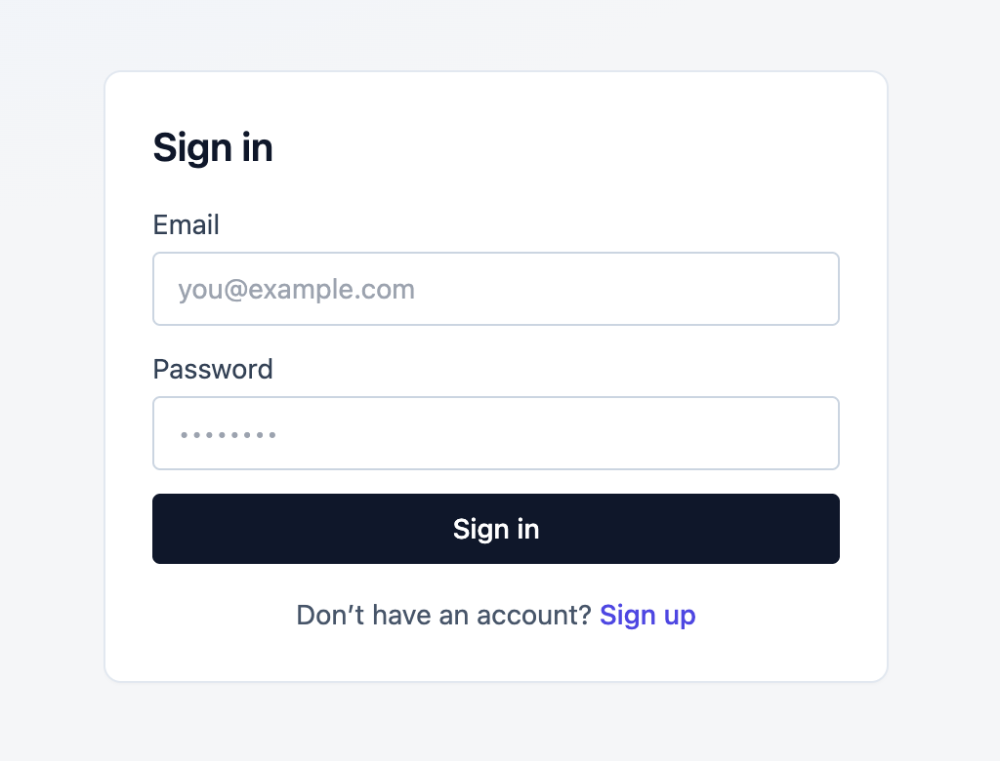

# 📦 Complete Inventory Management System

A full-stack inventory management system built with **Next.js 14**, **MongoDB**, and **NextAuth.js**.  
Users can create, update, delete, and filter product entries (name, category, price, quantity, status).  
Includes authentication (login/signup), bulk actions, and CSV export functionality.

---

## ✨ Features
- 🔐 User authentication (NextAuth.js with credentials provider)  
- ➕ Add, edit, and delete products  
- 🗂️ Bulk delete & bulk status update (active/archived)  
- 🔍 Search, filter, sort, and pagination  
- 📊 Dashboard with total stock, total value, and low-stock alerts  
- 📤 Export product list to CSV  
- 💻 Clean, responsive UI with Tailwind CSS  
- ⚡ Serverless API routes with Next.js App Router  

---

## 📷 Screenshots

### 🔑 Login / Signup  


### 📊 Dashboard  


### ➕ Add Product  


---

## 🚀 Tech Stack
- [Next.js 14](https://nextjs.org/) – React framework with App Router  
- [MongoDB](https://www.mongodb.com/) – Database  
- [Mongoose](https://mongoosejs.com/) – ODM for MongoDB  
- [NextAuth.js](https://next-auth.js.org/) – Authentication  
- [Tailwind CSS](https://tailwindcss.com/) – Styling  
- [Vercel](https://vercel.com/) – Deployment  

---

## 🛠️ Getting Started

### 1. Clone the repo
```bash
git clone https://github.com/your-username/inventory-system.git
cd inventory-system